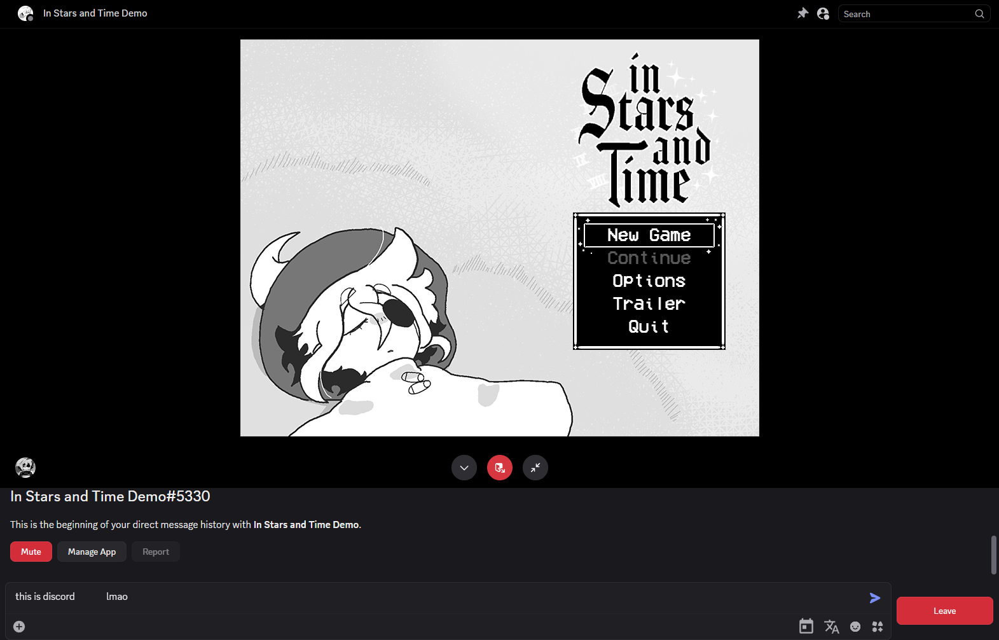
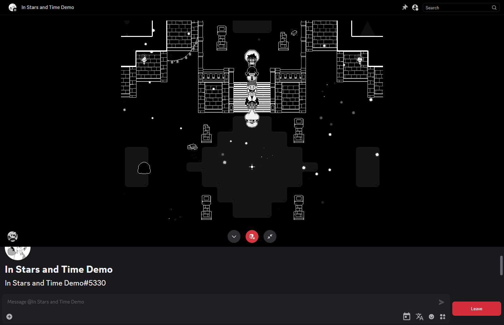

# In Stars and Time Demo (Discord activity port)

A (very hacked together) modification to the [In Stars and Time Demo](https://store.steampowered.com/app/1677310/In_Stars_And_Time/) to allow it to run within a Discord activity.

Add the activity to your account here: https://canary.discord.com/activities/745699210598547618

## Screenshots

## Issues

These issues may or may not be fixed in the future.

- The Battle UI uses the incorrect look.
- Attempting to change languages crashes the game
    - Language is forced to English and cannot be changed.

## Credits

All source code, assets, trademarks, etc. belongs to insertdisc5. 

"In Stars and Time (a soundtrack)" belongs to Studio Thumpy Puppy.

All modifications were created by stuartt. They do not own any assets.